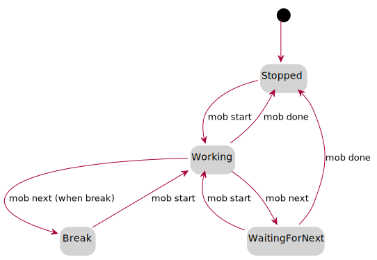

# mob

A console tool to work in a remote mob with git.

* Handover code fast between drivers
* Nice timer
* Remembers order of drivers
* Configurable interval for breaks and lunch

## How to install
Install rust if you don't have it and then run `make install` in this repo.

## Usage 
- `mob start` creates a new session or takes over from the
  previous driver. It will ask a bunch of questions about
  branches, work interval, break times if it needs.
- `mob next` hands over to the next driver.
- `mob done` squashes the feature branch to staging on the base branch
  (default master) and removes it.

Run `mob` for help on more commands.

## How it works
`mob` uses an orphan branch called `mob-meta` to save session
state and settings. You can view the session content with `mob
status` and delete it with `mob clean`.

The session can be in 4 different states:

## Thanks
Inspiration for this tool comes from [Remote mob
programming](https://www.remotemobprogramming.org/) and their tool
[mob](https://github.com/remotemobprogramming/mob) written in Go.
